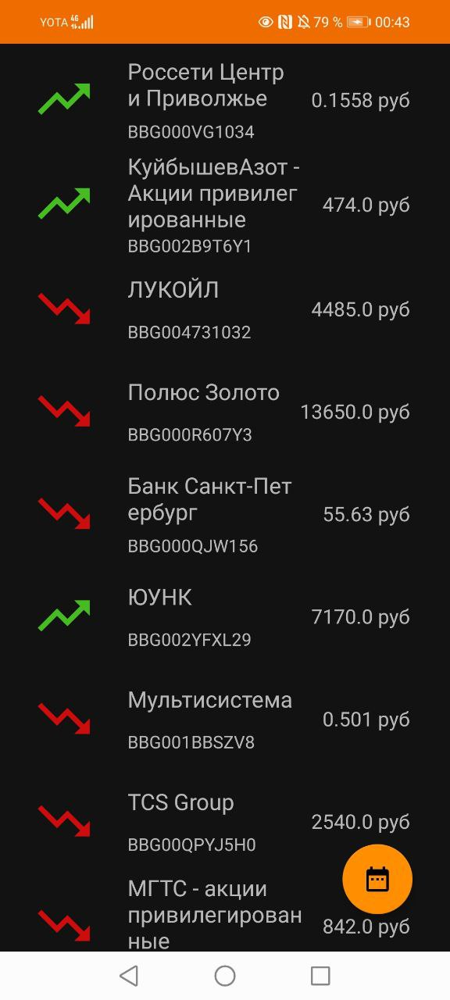

# Android приложение Прогноз стратегий

Совместный проект 7CreAtoR7 (https://github.com/7CreAtoR7) и FbGod.

Часть 7CreAtoR7 - сервер на Python с использованием Flask и tinkoff api, работа с Rest Api в мобильном приложении.
Часть FbGod - Ui мобильного приложения, парсинг данных из json, последующее сохранение их в бд SqLite, вывод результата на главный экран.

Приложение Прогноз стратегий.
Его идея заключается в том, чтобы инвестор смог выгодно вложить свой капитал.
Оно просчитывает насколько выгодно закупать те или иные ценные бумаги - акции, то есть:

**если бы Вы купили данную акцию 10 дней назад, то Вы получили бы прибыль или были бы в убытке**

Есть сервер, написанный на Python при помощи микрофреймворка Flask.
Он получает список акций при помощи tinkoff api и сохраняет их в json формате, а именно:
 - `последняя стоимость акции при - закрытии`
 - `дата последней торговли`
 - `figi id`
 - `массив из 100 последних цен закрытии`
 - `название компании`
 - `кол-во сделок в последний день торгов`

Сервер расположен на хостинге Heroku.

При запуске приложения запускается активность со сплэш скрином.
В это время приложение отправляет запрос на сервер и обрабатывает json при помощи библиотеки retrofit.
Каждую акцию и её историю цен обрабатывает алгоритм, который в дальнейшем планируется улучшить.

URL адрес на сервер:
`https://stocks-info.herokuapp.com/api/stocks`

Формат хранения данных на сервере:
`{"close_price_last_day":480.0,"figi":"BBG00ZHCX1X2","last_date":"01-04-2022","list_prices_last_100_day":[544.6,541.6,539.5,550.0,547.5,558.5,577.8,553.0,560.0,526.9,507.6,497.5,468.0,454.0,435.7,422.0,409.1,396.2,392.8,403.0,429.6,422.5,434.8,425.0,443.5,448.0,444.1,435.5,444.9,441.5,447.9,457.4,473.9,450.0,469.0,472.0,465.9,461.5,442.0,404.0,426.5,314.1,288.8,327.0,358.0,400.0,480.0],"name":"Fix Price Group","volume":979147},{"close_price_last_day":111.45,"figi":"BBG004730JJ5","last_date":"01-04-2022","list_prices_last_100_day":...`

 
